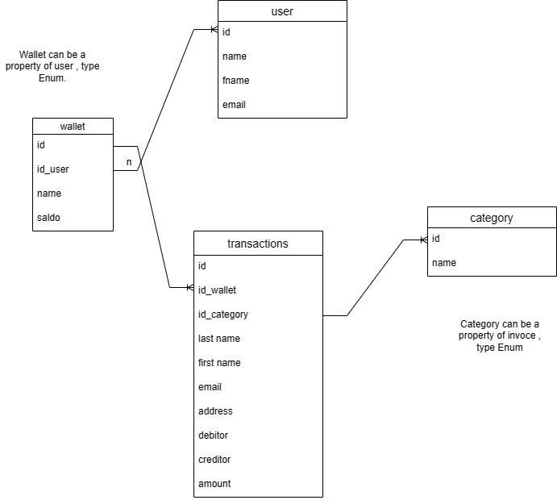

# This app can be used as a Money stats :) 
 I didnt use Bootstrap or any external bibliotek 

## Demo

Check out the live demo of my app: [Demo Link](https://main.d20ldbddf5hcx2.amplifyapp.com/homepage.html)

# To use this App follow this steps : 
  - click on the  [Demo Link](https://main.d20ldbddf5hcx2.amplifyapp.com/homepage.html)
  - in Home page click on Register 
  - enter verify code from your Email to end the register process 
  
  or if you don't would like to register
  - click on this link [Directly Link](https://main.d20ldbddf5hcx2.amplifyapp.com/view/wizard.html)

# Feature of this App :
Presently :
  - user very easy can input data for his expense and his income .
  - user is able to enter his categories regard of his transactions  (Salary , side Job , Groceries,haous, ...).
  - variety select for periods of transactions (monthly , weekly , ...) . 
  - In the dashboard there is a facility response of all transactions .
  - In transaction page there is search fields to have a nice view for preferred transactions .
  - There is notification page to alarm user ( if balance is below 200 ) .
  - User would be register in AWS Cognito user pool (high credential algorithm)
  - In addition app is deployed with AWS Amplify (very efficient for CI/CD)

In Future :
  - User can scan his Document and give it as image to app and then app can automatically fetch data from the image and fill the form and edit them .

# Data Structure :

 - controller
   - addExpenses.js
   - addIncome.js
   - dashboard.js
   - notification.js
   - periodsToday.js
   - periodsLastWeek.js
   - periodsLastMonth.js
   - periodsLastYear.js
   - transaction.js
   - wizardScript.js
 - src
   - image
     - HaushalsEntity.png
   - style.css
   - wizardStyle.css
 - view
   - addExpense.html
   - addIncome.html
   - dashboard.html
   - notification.html
   - transaction.html
   - wizard.html

